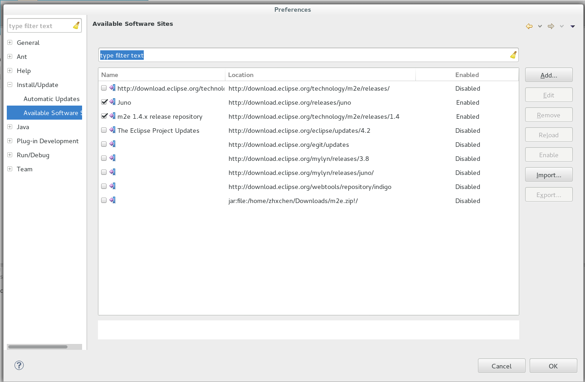
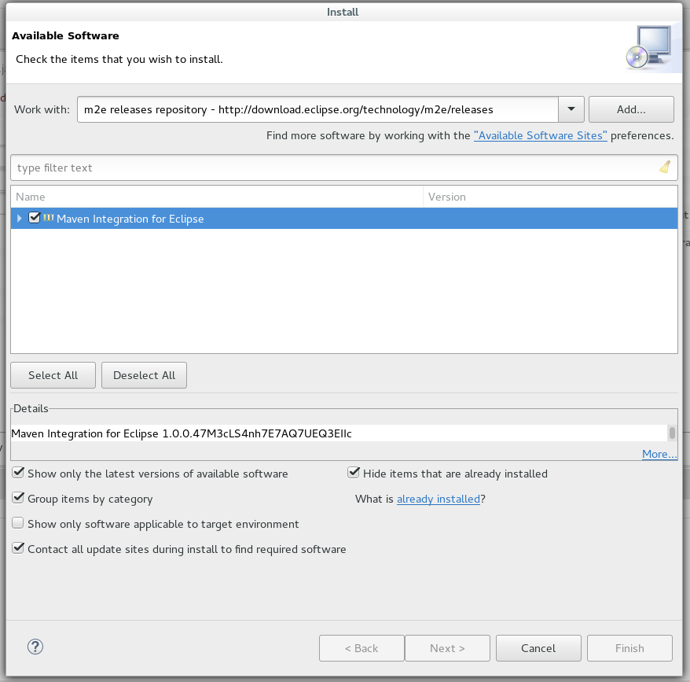

# Installation

Table of Contents:
- [Requirements](#requirements)
- [Installation](#installation)
- [Importing into Eclipse](#importing-into-eclipse)
- [Developer Guide](#developer-guide)

## Requirements

- One of Oracle JDK 1.8+ or OpenJDK 8+
- Maven 3.2.0+
- Vertica 6+ or Microsoft SQL Server 2008+ (only necessary for using the designer tool)
- SWIG 3.0.0+ and GLPK 4.56+ (only for developers)

## Installation

Attention: Before you install cliffguard, make sure $JAVA_HOME is set.

```bash
$ git clone https://github.com/mozafari/cliffguard.git
$ cd cliffguard
$ mvn clean package
```

After this step, the binary file (a JAR file) will be created in

```
./target/CliffGuard.jar
```

At this point, CliffGuard has been successfully compiled.
Refer to the README documentation to learn how you can use various tools that are included in the CliffGuard package.

##  Importing into Eclipse

### Requirements

- Eclipse (Luna or Mars version are recommended)
- m2eclipse plugin for Eclipse

If you are not sure about installation of m2eclipse, then

1. Select Window(from menu bar) -> Preference , expend Install/Update on side bar, and select "Available Software Sites", make sure to enable the item:
    If you are 
    + Juno user: Name: `Juno`(or `Eclipse Juno repository`), Location: `http://download.eclipse.org/releases/juno`
    + Kepler user: Name: `Kepler`(or `Eclipse Kepler repository`), Location: `http://download.eclipse.org/releases/kepler`
    + Luna user: `Luna`(or `Eclipse Luna repository`), Location: `http://download.eclipse.org/releases/luna`
    + Mars user: `Mars`(or `Eclipse Mars repository`), Location: `http://download.eclipse.org/releases/mars`
    
    Enable your corresponding item, like the following:
    <br>
    
    <br>
    
2. Check out Help -> Install New Software at menu bar. 
3. Check your Eclipse version,  
    + If you are an Eclipse Luna or Mars user, copy the link [http://download.eclipse.org/technology/m2e/releases](http://download.eclipse.org/technology/m2e/releases) 
    + If you are Juno or Kepler user, copy the link [http://download.eclipse.org/technology/m2e/releases/1.4](http://download.eclipse.org/technology/m2e/releases/1.4) 
   
4. Paste the link in previous step into "Work with" input box, then press "Add".
5. It is okay to leave the "Name" input box to be blank, then press "OK", and check "Maven Integration for Eclipse" in the following list view.
6. Check the option "Contact all update sites during install to find required software" at the bottom of the current window.
    At this point the screen should look like the following (again, Eclipse Juno and Kepler users should use http://download.eclipse.org/technology/m2e/releases/1.4).
    <br>
    
    <br>
7. Press "Next" -> "Next" -> "Finish".

### How to set up the project into Eclipse

1. From Eclipse, Project Explorer -> Right click -> Select Import Menu and Import, or from top menu bar, File -> Import.

2. Expand Maven menu, click "Existing Maven Projects", and click next.

3. Browse the location where you have the CliffGuard source code, select the top level root directory.

4. Click next, Eclipse will recognize project and it will show you a list of all possible projects located there.

5. Select the project org.cliffguard.cliffguard, click "Finish", then Eclipse shows some build information, then done.

## Developer Guide 
(Users should skip these steps)

**WARNING**: This developer guide is only intended for academic researchers. To follow the instructions below you need to be using the academic version (the academic version is different from the public oepn-source version that is available at [http://CliffGuard.org](http://CliffGuard.org)). The academic version is not open-source and is shared on a per-request basis. If you wish to access the academic version, please contact us at mozafari <AT> umich.edu.

### How to enable Vertica to empty the OS cache:

1. Run the following command as "dbadmin":

```bash
$ TOP_LEVEL_DIRECTORY/scripts/install_stored_procedures.sh
```

2. Run the following as root:

```bash
$ sudo chown root:root restartDB
$ sudo chmod u+s restartDB
```

3. Test it by running the following command in vsql:

```bash
vsql> select barzan_empty_cache();
```

and see if it prints out root! 

```
	INFO 4427:  Procedure reported:
	root

	 barzan_empty_cache 
	--------------------
			  0
	(1 row)
```

### Installing SWIG and GLPK

You only need to install SWIG and GLPK if you are looking to use some of the advanced features in CliffGuard. Not recommended for beginner users.

1. Make sure "swig" is installed, by trying:

```bash
$ swig
```

To install:

```bash
sudo yum install swig
```

2. Compile and install GLPK:

```bash
$ cd TOP_LEVEL_DIRECTORY/lib/
$ tar xvzf glpk-4.50.tar.gz
$ cd glpk-4.50
$ ./configure 
$ make
$ sudo make install
```
